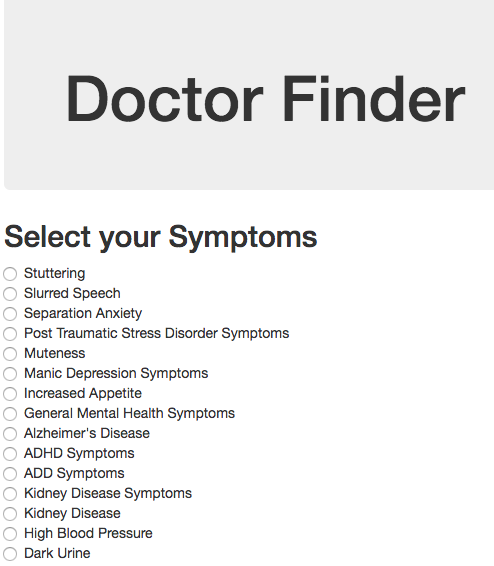
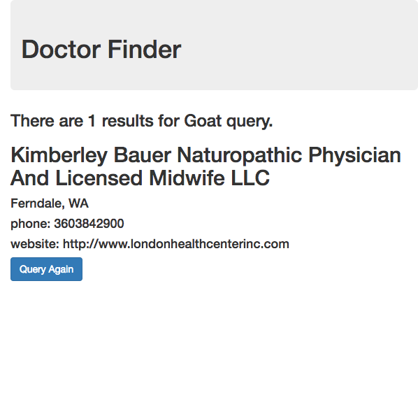

# Doctor Lookup

A web app for patients to enter in symptoms they are having. The website returns a list of nearby physicians to treat their ailments.


## Screenshots

### Main Page:


### Results Page:



### Setup/Installation Requirements
* Clone this repo by typing into the terminal:
```
$ git clone https://github.com/jennifer-kinsey/doctor-lookup.git
```

* run the following commands to download the necessary packages:
```
$ npm install
$ bower install
```

* create a top level file called .env
* add the following code:
```
exports.apiKey = "[YOURAPIKEYGOESHERE]";
```

* If you do not have an API key for the Better Doctor API you can go to:
https://developer.betterdoctor.com/ and sign up for one for free.

* now you are ready to run the project with:
```
$ gulp build --production
$ gulp serve
```

### Known Bugs
The data in this API isn't complete. There isn't always, for example, a practice name. The workaround is using the js OR operator to fill in blanks.
```
var office = result.practices[0].name || "unavailable";
```

Additionally, the entire practice part of the json file may not exist.

As a result, Sometimes the results for the doctor query will say there are 10 results and only 4 present on the page due to data not being available in the API.


### Technologies Used
* HTML / CSS
* jQuery
* Bootstrap
* NodeJS
* Gulp

### By Authors
Jennifer Kinsey

### Support and contact details
Send a message to the author via Github:
https://github.com/jennifer-kinsey


### License
The MIT License (MIT)

Copyright © 2017 Jennifer Kinsey

Permission is hereby granted, free of charge, to any person obtaining a copy of this software and associated documentation files (the "Software"), to deal in the Software without restriction, including without limitation the rights to use, copy, modify, merge, publish, distribute, sublicense, and/or sell copies of the Software, and to permit persons to whom the Software is furnished to do so, subject to the following conditions:

The above copyright notice and this permission notice shall be included in all copies or substantial portions of the Software.
